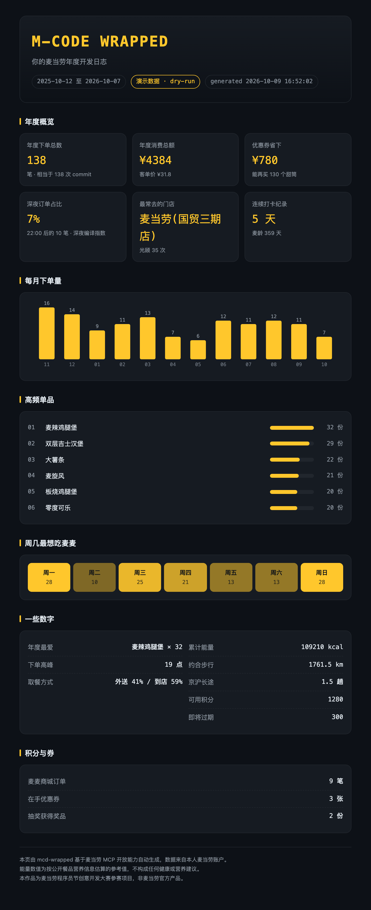

# M-CODE WRAPPED

**你的麦当劳年度开发日志。**

基于 [麦当劳 MCP](https://github.com/M-China/mcd-mcp-server) 开放能力，把你本人账户里
分散在订单页、会员中心、卡包、活动页的数据聚合成一份年度报告——
花了多少、点了什么、几点下单、常去哪家店、券省了多少钱、积分还剩多少，
一页看完，还能让粤语版的声音念给你听。

> 麦当劳程序员节创意开发大赛参赛作品 · 非麦当劳官方产品



> 样张由 `scripts/demo_data.py` 的演示数据生成。接入你自己的 Token 后，
> 跑一次 `collect.py` 就换成真实数据，版式完全一致。

## 为什么不是"又一个点餐助手"

大赛里大多数作品在做同一件事：怎么更便宜地下单。这个项目换个方向——
**把已经发生过的一年，变成一份值得截图的东西。**

| | 点餐助手 | M-CODE WRAPPED |
|---|---|---|
| 解决的问题 | 这一顿怎么买 | 这一年我都干了什么 |
| 数据视角 | 单次 | 跨模块、跨时间聚合 |
| 产物 | 一个订单 | 一份可转发的报告 + 一段方言语音 |
| 没有 Token 时 | 无法演示 | dry-run 出样张 |

## 快速开始

### 1. 申请 MCP Token

打开 [open.mcd.cn/mcp](https://open.mcd.cn/mcp)，手机号登录 → 控制台 → 激活 → 复制 Token。

```bash
export MCD_MCP_TOKEN=你的token
```

### 2. 拉数据

```bash
git clone https://github.com/<你的用户名>/mcd-wrapped.git
cd mcd-wrapped
python3 scripts/collect.py          # 需要 Python 3.9+，无第三方依赖
```

原始响应会存到 `data/raw/`，归一化结果写到 `data/report_data.json`。

### 3. 出报告

```bash
python3 scripts/build_report.py     # -> out/mcd-wrapped.html
```

打开 `out/mcd-wrapped.html`，截图，转发。

**没有 Token 也能看效果：**

```bash
python3 scripts/demo_data.py        # 生成一份确定性演示数据
python3 scripts/build_report.py
```

## 在 WorkBuddy 里用

把 `mcp-config.example.json` 的内容填进 WorkBuddy 的自定义连接器
（把 `${MCD_MCP_TOKEN}` 换成真实 Token），然后直接说：

> 帮我看看今年在麦当劳花了多少钱

或者装上本 Skill（把 `mcd-wrapped/` 整个目录放到 `~/.workbuddy/skills/` 下），
WorkBuddy 会自动识别并完成采集、渲染、播报全流程。

## 方言播报

```bash
python3 scripts/speak.py --dialect cantonese    # 粤语
python3 scripts/speak.py --dialect taiwanese    # 闽南语调
python3 scripts/speak.py --dialect mandarin     # 普通话
python3 scripts/speak.py --dry-run              # 只看播报稿
```

后端按 **VoxCPM2 → macOS 内置中文嗓音** 自动回退：

```bash
export VOXCPM_API_URL=http://127.0.0.1:7860     # 本地 VoxCPM2 Gradio 服务
export VOXCPM_REF_AUDIO=/path/to/四川话参考音频.wav
python3 scripts/speak.py --dialect voxcpm
```

接上 VoxCPM2 和方言参考音频后，可以克隆任意方言音色来念这份报告。

## 报告里有哪些数字

年度下单总数 · 年度消费总额 · 客单价 · 券省下的钱 · 深夜订单占比（深夜编译指数） ·
最常去的门店 · 连续打卡纪录 · 麦龄 · 每月下单趋势 · 高频单品 Top 6 · 周几最想吃 ·
下单高峰时段 · 取餐方式占比 · 累计能量与中性参照 · 可用积分与即将过期积分 ·
麦麦商城订单 · 在手优惠券 · 抽奖奖品

## 目录结构

```
mcd-wrapped/
├── SKILL.md                      Skill 定义，供 Agent 驱动全流程
├── MCP_INTEGRATION.md            使用的 MCP tool、调用流程与业务价值
├── CONTEST_DECLARATION.md        参赛声明（官方原文，未修改）
├── mcp-config.example.json       脱敏配置，仅环境变量占位符
├── scripts/
│   ├── mcp_client.py             MCP Streamable HTTP 客户端
│   ├── collect.py                采集 + 字段归一化
│   ├── demo_data.py              演示数据（dry-run）
│   ├── build_report.py           指标计算 + HTML 渲染
│   └── speak.py                  方言语音播报
├── references/
│   ├── mcp_tools.md              tool 清单与字段归一化说明
│   └── compliance.md             输出内容合规红线
└── assets/
    └── report_template.html      报告模板
```

## 合规说明

- 项目只用真实 Token 读取本人数据，不创建、不取消、不支付任何订单
- 配置文件仅使用环境变量占位符，不含任何凭证
- `draw-lottery` 会真实消耗积分，默认流程不调用
- 能量数值按公开营养信息估算，仅供参考，不构成健康或营养建议
- 完整红线见 `references/compliance.md`

## 目标用户

- 想回顾自己一年麦当劳消费记录的人
- 想要一份能发朋友圈/群聊的年度报告的人
- 想看看麦当劳 MCP 能做出什么不一样东西的开发者

## License

MIT
